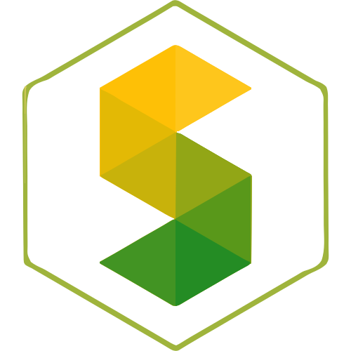

<!-- Don't delete it -->
<div name="readme-top"></div>

<!-- Organization Logo -->
<div align="center">
  
  &nbsp;
  &nbsp;
  
  &nbsp;
  &nbsp;
  
</div>

&nbsp;

<!-- Organization Name -->
<div align="center">

[](https://gluon.stability.nexus/)

</div>

<!-- Organization/Project Social Handles -->
<p align="center">
<!-- Telegram -->
<a href="https://t.me/StabilityNexus">
</a>
&nbsp;&nbsp;
<!-- X (formerly Twitter) -->
<a href="https://x.com/StabilityNexus">
</a>
&nbsp;&nbsp;
<!-- Discord -->
<a href="https://discord.gg/YzDKeEfWtS">
</a>
&nbsp;&nbsp;
<!-- Medium -->
<a href="https://news.stability.nexus/">
  </a>
&nbsp;&nbsp;
<!-- LinkedIn -->
<a href="https://linkedin.com/company/stability-nexus">
  </a>
&nbsp;&nbsp;
<!-- Youtube -->
<a href="https://www.youtube.com/@StabilityNexus">
  </a>
</p>

&nbsp;
<!-- Project core values and objective -->
<p align="center">
  <strong>
 Bene: Fundraising Platform is a decentralized application (DApp) that enables projects to receive funding in exchange for Proof of funding tokens. This DApp allows projects to request ETH(native currency of the network) in exchange for Proof of funding tokens, <a href="https://www.youtube.com/watch?v=HHN31PkUxaU">Know More</a>.
  </strong>
</p>

---

# Bene-Fundraising-EVM-Frontend

<details>
  <summary>Smart Contract Repo</summary>
  <ul>
    <li>(https://github.com/StabilityNexus/BenefactionPlatform-EVM)</li>
  </ul>
</details>
<details>
  <summary>Live Webiste URL</summary>
  <ul>
    <li>https://bene-evm.stability.nexus/</li>
  </ul>
</details>

<details>
  <summary>How it works</summary>
  - Each project contains two tokens:
  
  1.  **Auxiliary Project Token (APT)**: This token is minted during the project creation transaction and serves a main purposes:

      - **Contribution Tracking**: Temporarily, contributors receive this token when participating in the project. Once it is confirmed that a refund is no longer possible, contributors can exchange the APT for the **Proof-funding Token (PFT)**.
      - The total supply of APT equals the total issuance of PFT.

  2.  **Proof-funding Token (PFT)**: Unlike the APT, the PFT is not minted on the contract. It represents the project or its organization and may also reflect proof-funding for similar projects within the same organization. PFTs are distributed only after refund conditions are no longer applicable, ensuring proper tracking.

> The use of the APT ensures that during refunds, the origin of the token can be reliably traced to the current project. If PFTs were distributed immediately upon purchase, distinguishing whether a token originated from the current project or another related project would not be possible.

- Project owners can create a funding vault that holds an amount of tokens, which may vary, setting a **timestamp** as a deadline.
- A minimum amount of tokens must be sold before the project can withdraw funds. This ensures that the project receives sufficient backing.
- If the timestamp is reached before minimum amount of tokens are sold, users have the option to exchange their tokens back for the corresponding ETHs, provided the minimum has not been reached.

</details>
<details>
  <summary>Parameters of the funding vault</summary>
  
  - **timestamp**: The timestamp limit until withdrawal or refund is allowed.
- **Minimum Funding Amount**: The minimum number of ETH needs to be raised to enable withdrawals or refunds.
- **Proof of funding Token Address**: The smart contract address for the Proof-of-Funding token (e.g., 0x123...abc)
- **Proof of funding Token Amount**: Total Proof of funding tokens for the vault
- **ETH/Token Exchange Rate**: The exchange rate of ETHs per token.
- **Withdrawl Address**: The address to withdraw funds after raised successfully.
- **Project Title**: Title of the Project
- **Project URL**: URL of the Project
- **Project Description**: Description of the Project

</details>
<details>
  <summary>Processes</summary>
 
 The Bene: Fundraising Platform supports seven main processes:

1. **funding vault Creation**:

   - Allows anyone to create a funding vault with the specified script and parameters.
   - The funding vault represents the project's request for funds in exchange for a specific amount of tokens.
   - The tokens in the funding vault are provided by the funding vault creator, that is, the project owner.

2. **Token Acquisition**:

   - Users are allowed to exchange ETHs for **Auxiliary Project Tokens (APTs)** (at the R7 exchange rate) until there are no more tokens left, even if the deadline has passed.
   - Users receive APTs in their own funding vaultes, which adhere to token standards, making them visible and transferable through ETH wallets.

3. **Refund Tokens**:

   - Users are allowed to exchange APTs for ETHs (at the exchange rate) if and only if the deadline has passed and the minimum number of tokens has not been sold.
   - This ensures that participants can retrieve their contributions if the funding goal is not met.

4. **Withdraw ETHs**:

   - Project owners are allowed to withdraw ETHs if and only if the minimum number of tokens has been sold.
   - Project owners can only withdraw to the address specified in `withdrawl_address`.

5. **Withdraw Unsold Tokens**:

   - Project owners are allowed to withdraw unsold PFTs from the contract at any time.
   - Project owners can only withdraw to the address specified in `withdrawl_address`.

6. **Add Tokens**:

   - Project owners are allowed to add more APTs to the contract at any time.

7. **Redeem Tokens**:
   - Users are allowed to exchange **Auxiliary Project Tokens (APTs)** for **Proof-funding Tokens (PFTs)** if and only if the deadline has passed and the minimum number of tokens has been sold.


</details>
<details>
  <summary>Usage</summary>
 You can interact with the platform using the following webpage:

(https://bene-evm.stability.nexus/)
</details>
<details>
  <summary>Installation</summary>
  ## Prerequisites

- **Node.js and npm (or yarn):** Ensure you have the latest versions installed. You can download them from the [official Node.js website](https://nodejs.org/).
- **Code Editor:** Choose a code editor like [Visual Studio Code](https://code.visualstudio.com/), [Sublime Text](https://www.sublimetext.com/), or [WebStorm](https://www.jetbrains.com/webstorm/).

## Steps

### Clone the Repository

```bash
git clone https://github.com/your-username/benefactionevm.git
cd benefactionevm
```

### Install Dependencies

```bash
npm install

```

### Start the Development Server

```bash
npm run dev
```

This will start a development server, and your project will be accessible at http://localhost:5173/.

</details>

<!-- Project Description (Start from here) -->

<!-- Use Back Button after each section -->
<div align="right"><kbd><a href="#readme-top">↑ Back to top ↑</a></kbd></div>

---

<!-- Don't delete it -->
<!-- Funding Badge -->
<div align="center" name="fund">
<a href="https://docs.stability.nexus/about-us/fund-us"></a>
</div>


